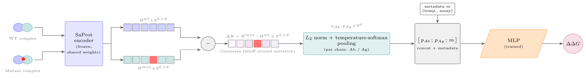
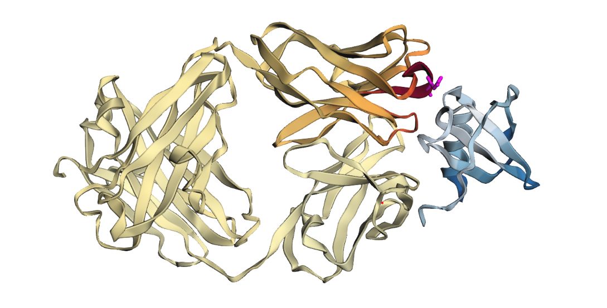

# SKEMPI ΔΔG Predictor

Predicts the change in antibody-antigen binding free energy (ΔΔG) caused by a
point mutation, from SKEMPI structures/sequences. See `docs/summary.md` for a
one-page overview, `docs/` for full design rationale and results per stage,
and `docs/future_work.md` for open gaps.

## Hardware & runtime

Developed on a CPU-only machine; a single V100 GPU is sufficient for the real
run. Needs a Linux environment (see Setup) to build the `foldseek` +
SaProt-embedding cache. Training the committed checkpoint (20 epochs,
`structure_saprot_only_linear_splitpool_temp5_same_pdb_allowed_20ep`) takes
about 10 minutes on a V100 once embeddings are cached.

## Setup

```bash
uv sync
```

Python >=3.11, PyTorch 2.6. Device selection is automatic (CPU here, CUDA on
Colab, no code changes needed). SaProt embeddings additionally need a local
`foldseek` binary and `SKEMPI_USE_SAPROT_STRUCTURE=1` -- foldseek ships no
native Windows build, so on Windows this step (and anything that depends on
it, including `predict.py`/`train.py --mode eval` against the committed
checkpoint for any sample not already embedding-cached) needs a Linux
environment: WSL, a Linux/Colab machine, or macOS.

## Model



Two-branch design; full rationale and the loss formulation in
`docs/03_model_and_training.md`:

1. **Encode** the wild-type and mutant complex with **SaProt** (frozen,
   shared weights) -- a structure-aware protein language model that fuses
   sequence and 3Di structural tokens into one per-residue embedding.
2. **Confidence-weight** each branch (structural x sequence for the mutant;
   sequence-only for the wild type, since it's the real deposited structure).
3. **Subtract** mutant minus wild-type, per residue. Mutation identity
   (position, wild-type -> mutant residue) is inferred purely from this
   embedding difference -- there is deliberately no separate explicit
   mutation-location feature, a documented, user-approved deviation from the
   Implementation Spec's literal wording (see `CLAUDE.md`).
4. **Pool**: a temperature-softened softmax over each residue's
   difference-vector L2 norm, computed independently per chain role
   (antibody / antigen) and concatenated. This diff-norm alone localizes the
   true mutation site with ~99.7-100% top-1 accuracy (see "Model evaluation
   & error analysis" below); temperature (T=5.0) keeps the softmax from
   collapsing onto a single residue.
5. Concatenate optional per-sample metadata (e.g. temperature), then a
   linear/MLP regression head -- the only trained component in the pipeline.

## 1. Data pipeline

```bash
uv run python -c "from data.pipeline import run_preprocessing_pipeline; run_preprocessing_pipeline()"
```

Builds `MutationRecord`s from raw SKEMPI + PDB downloads (filtering, homology
dedup, train/val splits) into `data/processed/` and `data/splits/`.

## 2. Embedding pipeline

```bash
uv run python -c "from data.embedding_pipeline.pipeline import run_embedding_pipeline; run_embedding_pipeline()"
```

Computes and caches per-sample embeddings (ESM-2, IgFold, SaProt) into
`data/embeddings/`. Separate from step 1 so it can be skipped on rerun.

## 3. Training

```bash
uv run python train.py --config dl/configs/structure_saprot_only_linear_splitpool_temp5_same_pdb_allowed_20ep.yaml
```

See `dl/configs/README.md` for what each config varies. Comet tracking is
automatic; set your own API key via Comet's standard env vars.

## 4. Evaluation & inference

A trained checkpoint is committed at
`checkpoints/structure_saprot_only_linear_splitpool_temp5_same_pdb_allowed_20ep.ckpt`
(current-best config, tiny since the only trained component is the regression
head) so evaluation/inference work on a fresh clone without training first —
also needs `data/splits/`, `data/processed/`, and `data/raw/skempi_v2.csv`
(all committed) plus `SKEMPI_USE_SAPROT_STRUCTURE=1 SKEMPI_USE_SMALL_CHECKPOINTS=0`:

```bash
uv run python train.py --config dl/configs/<name>.yaml --mode eval --ckpt <path>
uv run python predict.py --config dl/configs/<name>.yaml --ckpt <path> --input <mutations.csv>
```

`predict.py` prints a predicted ΔΔG per row plus whether that row's complex
was seen during the checkpoint's training (see its module docstring). Any
sample not already in the embedding cache is computed on the fly from
`data/raw/pdbs/*.pdb` (auto-fetched from RCSB if missing) — not committed,
since the full cache is 11GB.

## Results

Training/SKEMPI benchmark results, bucketed MAE vs. baseline, and the
classical-regressor sanity check: see `notebooks/04_results.ipynb` (numbers
also summarized in `docs/summary.md`); per-run training/loss curves are
tracked in Comet.

## Model evaluation & error analysis



Mutation-localization evidence and error analysis (the diff-norm above
concentrating at the true mutation site) is in `notebooks/03_model.ipynb` and
`docs/01_data_exploration.md`; standalone interactive 3D views are
`notebooks/pooling_norms_3d_*.html`.

## Limitations & next steps

See `docs/future_work.md` for the full list (data scope, model scope,
compute/scale, heuristics worth revisiting). One environment-specific gap:
**foldseek** (needed for SaProt structure embeddings) ships no native
Windows build — a Linux, WSL, macOS, or Colab environment is required for
that step.

## Notebooks

Four, backed by `notebooks/utils.py`:
- `01_data_exploration.ipynb` — dataset description, dedup, stratification, gaps.
- `02_data_preprocessing.ipynb` — embedding model choice and pipeline stats.
- `03_model.ipynb` — architecture stages and proof the mut−wt diff localizes
  the mutation (incl. inline 3D structure view; `pooling_norms_3d_*.html` are
  the standalone interactive versions).
- `04_results.ipynb` — bucketed MAE vs. baseline, classical-regressor check.

## AI prompt history

Raw Claude Code session logs: `docs/ai_prompt_history/claude_code_sessions_export.zip`.
